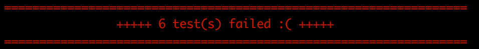
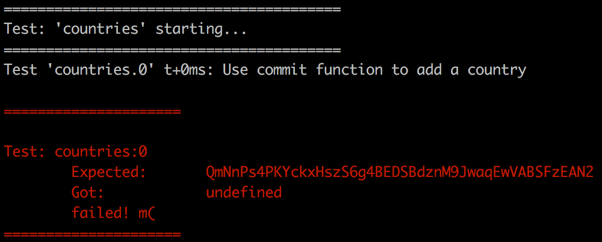
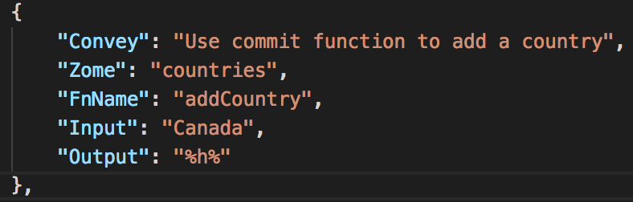
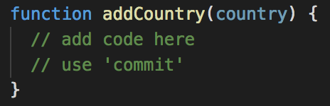
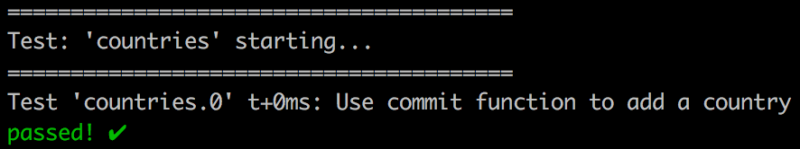

# Learn basic Read, Write, and Validation capabilities on Holochain
This repository can be used for learning some of the basic read/write capabilities of Holochain. 

It uses a pattern known as "test-driven development", which means that there are "tests" predefined. It attempts to call a function, passes an example input, and expects a particular output. Your job is to complete the code within the functions so that they succeed rather than fail.

There are 5 unique tests to try to build your skills and knowledge.

The test file is in `/test/countries.json`.

## Instructions

Make sure Holochain is [installed](https://developer.holochain.org/Install_Holochain)

Download this repository to your computer.

Open a terminal. 

Change directories in your terminal this apps folder on your computer, wherever it was downloaded to. (Use or lookup `cd` command if you're not familiar)

Run the Holochain `hcdev test` command in the terminal. This will execute the tests in a sequential order (from top to bottom in the `/test/countries.json` file). You will see that all the tests are failing.

Scroll so that you can see the first test. It looks like this:

First, read the description of the test, "Use commit function to add a country". Then, compare the "Expected: " result, with the "Got: " result. They are different, and we want them to be equal. 

Next, open up a code editor like Atom, Sublime Text, or VSCode, and open this app folder as a project in your editor. From the file tree, open `/test/countries.json` in your code editor. Look at the first test.

What does this all mean?
- Convey is the description of the test, and the instructions for solving it
- Zome is a reference to where the code this test calls is, in this case `/dna/countries/countries.js`
- FnName is the name of the function which this test calls, which should be defined within the code file mentioned above, in this case `addCountry`
- Input is the value the test will pass to the function, in this case 'Canada'
- Output is the value we expect calling the function to result in

Where you see `%h%` in `Output` may look confusing. To see an explanation, go to the [testing page](https://developer.holochain.org/Test_Driven_Development) on the developer documentation, and check out the Replacement Strings section.

Now, open the file `/dna/countries/countries.js` in your code editor. This will be where you will be working to solve the tests.

Look for the function `addCountry` in the code.

When it says to "use 'commit'" function, it means to look up the `commit` function in the developer documention, on the [API page](https://developer.holochain.org/API). This will tell you how to use this function, what it does, and show you an example. Use that knowledge to write the code to make the function work as expected.

When you've written the code, go back to the terminal and run `hcdev test` again. If you've succeeded, the terminal will say that only 4 tests failed, down from 6, and show this result for the first test.

Repeat this for all the remaining tests one by one until they are all passing.
If you get really stuck, or you've completed it and want to see the solutions, check them out in the [solution branch of this repository](https://github.com/holochain/dev-camp-test/tree/solution).